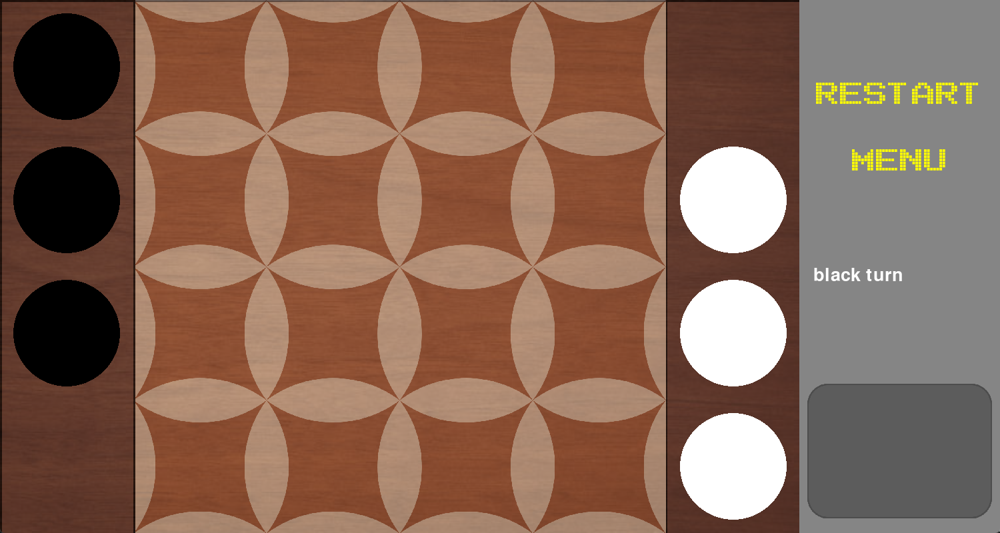
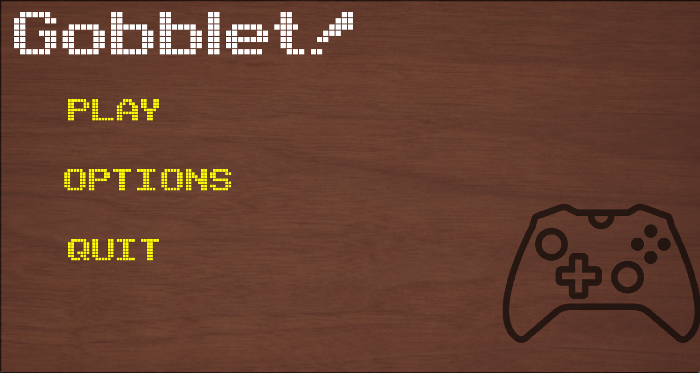
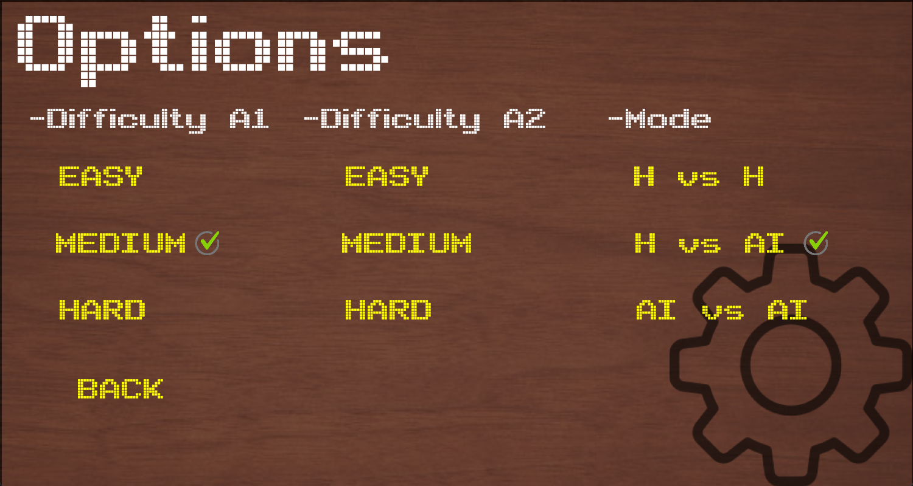
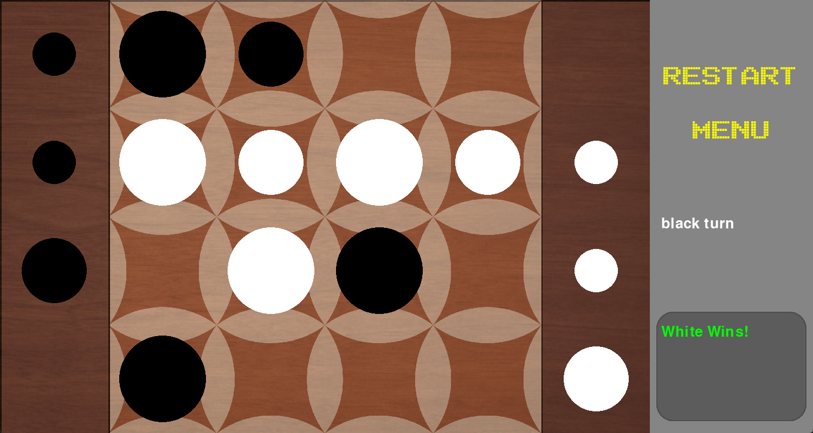

# Gobblet
* Gobblet is an abstract game played on a 4x4 grid with each of the two players starting with twelve pieces that can nest on top of one another.
* The goal is to line up four gobblets of your color in a row. It's easy to play, but hard to master!
## Game Rules
* Each player has three stacks of pieces, all of the same color, and each stack consists of four pieces of different sizes.
* At the beginning of the game, each stack is arranged outside the playing area in such a way that the smaller piece is covered by the larger one.
* **Players take turns and in each turn, they have two options:**
    * Place a new piece from the external stack onto the playing board.
    * Move a piece that is already on the board to a different position.
 * New pieces from external stacks can only be taken in order of size, meaning only the piece that is on top of one of the stacks can be chosen.
    * It can be placed only on an empty square, with the exception of cases where the opponent has three of their pieces in a row, column, or diagonally, In this case, the new piece can cover one of these three opponent's pieces.
* Moving a piece that is already on the board is allowed to any square where only smaller pieces are placed, allowing the moved piece to cover them.
    * It is allowed to cover one's own pieces or move a piece to an empty square.
    

## Game Playing Algorithms

### Minimax
* The minimax theorem states that for every two-player, zero-sum game (finite strategy space), there exists a value `V` and mixed strategies for each player, such that:
    * With the strategy given for the other player, the best possible result for the first player is `V`, and
    * With the strategy given for the first player, the best possible result for the second player is `-V`.
    * Equivalently, the strategy of the first player ensures a result of `V` regardless of the strategy of the second player.
    * Similarly, the strategy of the second player ensures a result of `-V`.
* The term "minimax" comes from the fact that each player tries to minimize the maximum result for the opposing player.
    * Since these are zero-sum games, it also means minimizing their own maximum loss or maximizing their minimum result.

* Two players, named MAX and MIN, make moves with pieces until the game ends. At the end of the game, the winner receives the maximum number of points, and the loser receives the minimum. Formally, it is a search problem with the following components:
    * The initial state is the state of the game board and information about which player is on the move.
    * The function for generating new states returns a set of pairs (move, new state), where each pair represents a valid move and the state after the move.
    * The end state test checks whether the game is over and reports the winner. States in which the game ends are final states.
    * The evaluation function provides a numerical value for the end state. In zero-sum games, the evaluation of the second player is the opposite of the evaluation of the first player.

* While minimax finds the optimal solution (i.e., the most advantageous move in a given state of the game), it is highly inefficient. 

### Alpha-Beta Pruning

* Due to the exponential expansion of the tree in the minimax algorithm, it is necessary to employ certain optimizations. The most common methods involve pruning unpromising branches of the tree, and one frequently used technique is alpha-beta pruning.

* The alpha-beta algorithm follows the principles of the minimax algorithm but is based on the idea that for moves that are good enough, it is not necessary to precisely determine how good they are. Similarly, for moves that are worse than the currently evaluated ones, there is no need to know exactly how bad they are.

* The alpha-beta algorithm is named after the parameters that represent bounds for the backward propagation of scores during the depth-first search. 
    * α is the value of the best score found so far on the path for the MAX player.
    * β is the value of the best score on the path for the MIN player.
    * Alpha-beta search updates the values of α and β and prunes the remaining subtrees as soon as the score of their node falls below the current value of α or β for the MAX or MIN player.

* While alpha-beta pruning significantly reduces the size of the game tree, guaranteeing the discovery of the optimal solution, its efficiency is highly influenced by the order in which individual moves are explored.
    * If the best move is always tried first, the other moves at that level get "cut off." In such a case, only the square root of number of nodes of what standard minimax explores are explored. 
    * In other words, alpha-beta pruning can, under optimal conditions, explore a tree twice as deep as minimax in the same amount of time.
    * The efficiency of these two algorithms is the same if the moves are explored in the worst order, i.e., the best move is tried last. This implies that even with a random ordering of moves, alpha-beta pruning is likely to be more effective than minimax alone.

## Heuristics
* Since alpha-beta pruning, with appropriate move ordering, can enhance the efficiency of tree traversal. 
    * Ideally, it can result in pruning up to the square root of the total number of visited nodes in the tree. The goal is to get as close as possible to this state.

* Move ordering method is implemented that sorts moves based on their actual impact on the current game situation.
    * It works by conducting a shallow search to a depth of 1 in each node after obtaining a list of all allowed moves.
    * Outer moves are likely to be more advantageous in the short term (adding a new piece always increases the evaluation)
    * The resulting states are evaluated, and this evaluation serves as the "score" for the respective move.
    * Moves are then sorted either in descending or ascending order based on the score, depending on whether it is the maximizing or minimizing player's turn.
* The evaluation function, is a method of assessing non-terminal states of the game.
    * It should represent the minimax value of a node as accurately as possible, allowing the alpha-beta pruning to reject a large number of truly unpromising moves and thereby significantly accelerate the search through the game tree.
* We used pattern based heuristics.
    * These are arrangements of a part of the playing board assigned a specific score.
    * We created a list of all possible arrangements of visible (uncovered) pieces in a row, column, or diagonal, totaling 81 patterns.
    * The reason for not considering hidden pieces in this case was primarily for simplicity – the pattern list should be reasonably sized to estimate the weight of each pattern – and also the fact that only the first covered piece significantly influences the game state. 
    * This piece can be easily revealed through shallow search.
    * The influence of this piece would be incorrectly neglected only if the algorithm chose to move a piece covering it, and that in the deepest level of search.
    * pieces covered by two or even three other pieces rarely impact the game; often, they are not moved until the end of the game.

* the computation of the evaluation function is done for each leaf node.
    * its the most time consuming part of the program and must be very fast so a precomputed hashtable of pattern is precomputed with descending order of avantage for the white player and the score used in the evaluation calculation
* The overall evaluation of the game situation is then calculated as the sum of pattern scores from all rows, columns, and both diagonals, further increased by the evaluation of individual pieces.
    * The evaluation only considers the highest piece on each square.
    * We chose the numerical evaluation as follows: 100, 50, 20, and 1 for pieces of size 4 , 3, 2 and 1 respectively, in this order.
    * For black pieces, this evaluation is taken negatively.
* Endgame states, meaning stacks of four pieces of the same color, or three and an open position should generally have significantly higher scores to make them clearly preferable for the minimax algorithm.

* Both algorithms described so far have a disadvantage that significantly limits their practical use in real gameplay. 
    * They are stacks with a fixed search depth, without any time constraint on computation.
    * However, time is often the most critical measure of the effectiveness of search algorithms the time to find one move is typically limited.
    * Therefore, it is highly desirable for an algorithm to have built-in awareness of its runtime and react appropriately when this time limit is reached.

* Another widely-used searching technique was implemented that enables this control, known as Iterative Deepening (ID).
    * It is essentially a standard depth-first search but with gradually increasing maximum depth. The ID algorithm first traverses the game tree to a depth of 2 and remembers the best solution.
    * If it can continue (if there is still time), it increases the maximum depth by one level, and the search begins from the root of the tree.
    * In each level, except for the second-to-last and last levels, valid moves are sorted in the same way as in the previous algorithm, based on their impact on the evaluation of the game situation
    * in ID many nodes are explored multiple times, so ID must be coupled with caching techniques for scores in already visited levels and move ordering for it to be better than just searching through a certain depth.

# Snapshots

